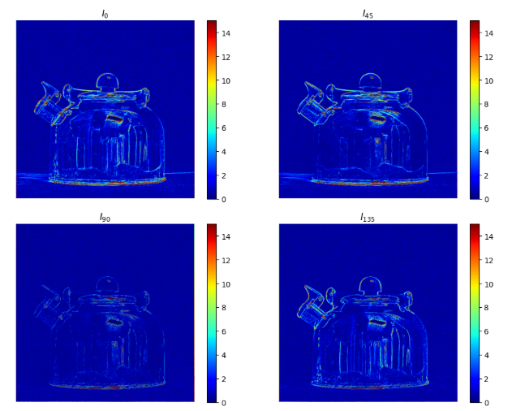

Title: Conclusiones
Date: 2025-05-28
Category: Page
Ordinal: 005

## Resultados 

En la  se puede ver el mapa de error para cada uno de los cuatro canales correspondientes a la imagen *kettle.png*. 

Figura: Mapas de error {#fig_mapa_error}

{#fig_mapa_error width=600} 

Notar como las diferencias no son demasiado grandes: el máximo error es de alrededor de 14.

A continuación se detallan los valores promedio para las métricas calculadas, para los casos de interpolación sobre los tres canales con el algoritmo programado y con interpolación bilineal:

|Interpolación|MSE|SSIM|PSNR|
|---|---|---|---|
|PCDP|17.277|0.957|37.019|
|Bilineal|19.810|0.969|36.138|

##Conclusiones
Se logró implementar el algoritmo propuesto por Rongyan Wu et al, obteniendo imágenes mantienen un gran parecido a las originales. Los errores obtenidos en los mapas de error no son particularmente significativos. 
Los valores promedio de SSIM (cercano a 1) y PSNR (más de 30 dB) obtenidos con el algoritmo son buenos.

Comparando el algoritmo implementado con la interpolación bilineal, se observa una mejoría en cuanto al MSE y la PSNR de aproximadamente 2.5 y 0.9, aunque el valor de SSIM sufrió una pérdida de 0.012. En líneas generales, se considera que los resultados
son satisfactorios y que efectivamente el algoritmo de PCDP proporciona una interpolación mejor que la bilineal.

A futuro sería ideal explorar otros esquemas clásicos de interpolación (como por ejemplo vecino más cercano), comparándolos con el algoritmo implementado. De esa forma se podría tener un resultado más general sobre el desempeño del mismo. 
Otra posible comparación sería tomar únicamente, por ejemplo, el canal verde para la interpolación bilineal, comparándolo con el resultado para el canal verde con el algoritmo de Rongyan Wu et al.
