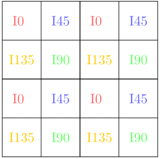

Title: Experimentos
Date: 2025-05-28
Category: Page
Ordinal: 004

## Experimentos

Para generar las imágenes de entrada para el algoritmo principal, se submuestra las imágenes del dataset con el fin de disminuir su resolución a la cuarta parte de la original.
Una vez submuestreadas, los píxeles de las mismas se utilizan para formar una nueva imagen del estilo obtenido por una cámara *DoFP*. Esto se logra ubicando los píxeles de las imágenes
en el lugar correspondiente al ángulo de polarización de la imágen sin submuestrear, como se ve en la 

Figura: Estructura de las imágenes de entrada del algoritmo principal. {#fig_dofp_constr}

{#fig_dofp_constr width=200}

Las imágenes originales del dataset, sin submuestrear, consituyen el *Ground Truth* del proyecto contra el cual comparar los resultados del algoritmo.

Sobre las imágenes de tipo *DoFP* construidas se aplica el algoritmo principal de interpolación. Para cada una se calculan como métricas el *error cuadrático medio (MSE)*, la *Structural Similarity Index Measure (SSIM)* y la *Peak Signal-to-Noise Ratio (PSNR)* así como un *mapa de error* para medir la diferencia entre la salida del algortimo implementado y la imagen original del dataset. Estos resultados son comparados, además, con los obtenidos mediante un esquema de interpolación más "tradicionale", como lo es la interpolación bilineal.

Dos de las medidas mencionadas (*MSE* y *PSNR*) se calculan a partir de la diferencia entre la imagen correspondiente al Ground Truth y la salida del algoritmo, es decir, solamente toman a las dos imagenes como matrices de números, sin tener en cuenta como son percibidas por el ojo humano. *SSIM*, por otro lado, utiliza medidas de contraste, luminancia y estructura para intentar obtener un valor que mejor represente qué tan bien veríamos la imagen.
Los mapas de error se obtienen a partir del valor absoluto de la diferencia entre las imágenes, proporcionando una forma más visual de medir el rendimiento del algoritmo.

