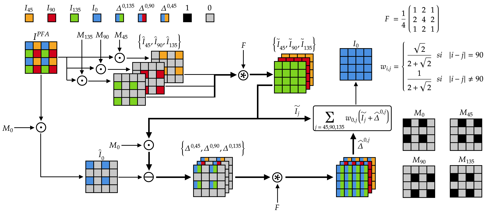
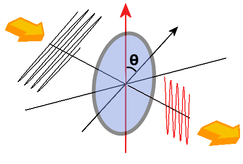

Title: Métodos
Date: 2025-05-28
Category: Page
Ordinal: 002

El proyecto se centra en la implementación del algoritmo de interpolación PCDP (Polarization Channel Difference Prior) propuesto por Rongyan Wu et al. en su artículo “Fast and accurate polarization demosaicking based on polarization channel difference prior” [@liu2021]. Dicho algoritmo se basa en la observación de que la diferencia entre dos canales presenta una mayor energía en las altas frecuencias sobre los bordes de los objetos. De esta forma se podría subsanar el problema que presentan los esquemas de interpolación clásicos.

## Algoritmo propuesto

Llamamos $I^{PFA}$ a la imagen original obtenida mediante *DoFP* y *$P_i$* al conjunto de los píxeles de dicha imagen correspondientes a uno de los cuatro canales ($i \in \{0, 45,90,135\})$. Entonces, el algoritmo propuesto es el siguiente:

 1. Obtener una máscara a partir de cada canal, definida para cada píxel $p$ como:

$$
	     M_i =	mask_i(p) =
        \begin{cases}
        1,       & \text{si } p \in P_i \\
        0,    & \text{en otro caso} 
        \end{cases}
        .
$$

 2. Para cada canal i, obtener una imagen que solo contenga los píxeles correspondiente a un cierto ángulo:

$$
\hat{I_i} = I^{PFA} \odot M_i,
$$ 

donde $\odot$ es el producto punto a punto entre dos matrices.
3. Interpolar cada canal utilizando una matriz *F* definida como:

$$
F = \frac{1}{4}
        \begin{bmatrix}
        1 & 2 & 1 \\
        2 & 4 & 2 \\
        1 & 2 & 1 \\
        \end{bmatrix},
$$

obteniendo:

$$
\tilde{I_i} = \hat{I_i} * F,
$$

donde $*$ representa la convolución.

4. Para cada par de canales $i$, $j$, computar su diferencia:

$$
\Delta^{i,j} = (\hat{I_i} - \tilde{I_j}\odot M_i) * F,
$$

donde se aplica la máscara de $i$ sobre $j$ pues de lo contrario no habría información de $j$ en los píxeles donde hay información de $i$.

5. Finalmente se estima cada canal mediante:

$$
I_i = \sum_{j \neq i}w_{i,j}(\tilde{I_j}+\Delta^{i,j}),
$$

con los pesos:

$$
w_{i,j} =
        \begin{cases}
        \frac{\sqrt{2}}{2+\sqrt{2}},& \text{si } |i-j| = 90 \\
        \frac{1}{2+\sqrt{2}},& \text{si } |i-j| \neq 90 \\
        \end{cases}.
$$

El diagrama de bloques del algortimo a implementar puede verse en la [](#fig_Diagrama_de_Bloques).

Figura: Diagrama de bloques del algoritmo. {#fig_Diagrama_de_Bloques}

{#fig_Diagrama_de_Bloques}

Sí se observa con detenimiento el diagrama de bloques representado en la [](#fig_Diagrama_de_Bloques),
se puede apreciar que el mismo tiene como salida la imagen $I_0$. Esto es debido a que, con el objetivo de simplificar el esquema,
en la [](#fig_Diagrama_de_Bloques) solo se representa la parte del diagrama de bloques que se encarga de producir la salida $I_0$.
El diagrama de bloques completo, se forma repitiendo de forma análoga la [](#fig_Diagrama_de_Bloques) para producir las salidas $I_{45}$,
$I_{90}$ y $I_{135}$. Resumidamente, se puede afirmar que, el diagrama de bloques completo está formado por 4 bloques paralelos, análogos al diagrama
de bloques representado en la [](#fig_Diagrama_de_Bloques).

## Implementación en Python

En el siguiente código Python, se puede apreciar la implmenetación del diagrama de bloques principal.

``` python
def reconstruct_polarized_images(I_PFA):
  M = {
    0: get_polarization_mask(I_PFA.shape, 0),
    45: get_polarization_mask(I_PFA.shape, 45),
    90: get_polarization_mask(I_PFA.shape, 90),
    135: get_polarization_mask(I_PFA.shape, 135)
  }
  I_hat = {
    0: I_PFA *  M[0],
    45: I_PFA *  M[45],
    90: I_PFA *  M[90],
    135: I_PFA *  M[135]
  }
  I_tilde = {
    0: quick_bilinear_interpolation(I_hat[0]),
    45: quick_bilinear_interpolation(I_hat[45]),
    90: quick_bilinear_interpolation(I_hat[90]),
    135: quick_bilinear_interpolation(I_hat[135])
  }
  polarized_images = []
  for i in valid_angles:
    complementary_angles = valid_angles.copy()
    complementary_angles.remove(i)
    I_i = np.zeros(I_PFA.shape)
    for j in complementary_angles:
      delta_hat = quick_bilinear_interpolation(I_hat[i] - (I_tilde[j] * M[i]))
      I_i += get_fusion_weight(i, j) * (I_tilde[j] + delta_hat)
    polarized_images.append(I_i)
  return tuple(polarized_images)

```

Para obtener más detalles de la implementación, visitar el [Repositorio del proyecto](https://gitlab.fing.edu.uy/timag/2025/proyectos/2025-proyecto-grupo-07).


## Desarrollo Teórico

A continuación se demuestra que la diferencia de un par de canales a través de un borde se maximiza cuando son ortogonales entre sí.

Como una grilla $DoFP$ no permite obtener luz polarizada elípticamente, consideramos que la intensidad total $I$ puede considerarse la suma de la luz polarizada linealmente y la luz no polarizada: 

$$
I = I_{L} + I_{U},
$$

donde $I_{L}$ es la intensidad de luz polarizada linealmente y $I_{U}$ es la intensidad de luz sin polarizar.
Según la *Ley de Malus*, la intensidad de luz polarizada linealmente que atraviesa un polarizador con un ángulo $theta$ (como en la [](#fig_malus)), se puede escribir como $I_ocos(\theta)^2$. A partir de dicha ley obtenemos:

$$
I_\theta = I_Lcos^2(\theta - \phi) + \frac{I_u}{2},
$$

Figura: Luz incidiendo con ángulo $\theta$ sobre un polarizador. {#fig_malus}

{#fig_malus width=300}

donde $\phi$ es el *AoLP*.
Pasamos ahora a calcular las diferencias entre las intensidades de luz polarizadas. Por simplicidad consideramos únicamente el caso de 0 grados, pero los otros son análogos:

$$
\Delta^{0,45} = I_0 - I_{45} = I_L\frac{1}{2}(cos(2\phi)-sin(2\phi)) \\
\Delta^{0,90} = I_0 - I_{90} = I_L\frac{1}{2}cos(2\phi) \\
\Delta^{135} = I_0 - I_{135} = I_L\frac{1}{2}(cos(2\phi)+sin(2\phi)).
$$

Observar que la diferencia depende únicamente del *AoLP* y de la luz polarizada, y no de la  luz sin polarizar.

Consideramos ahora dos píxeles adyacentes, *p* y *q*. Sus intensidades de luz polarizada serán $I_p$ e $I_q$ y sus ángulos de polarización serán $\phi_p$ y $\phi_q$, respectivamente.

En una imagen de tres canales, podemos definir una distancia entre dichos píxeles $\sigma$ (tratando dichos canales de forma independiente):

$$
\sigma^{0,45} = |\Delta_p^{0,45} -\Delta_q^{0,45}| = \frac{1}{2}|I_p(cos(2\phi_p) - sin(2\phi_p)) - I_q(cos(2\phi_q) +sin(2\phi_q))| \\\sigma^{90} = |\Delta_p^{90} -\Delta_q^{0,90}| = \frac{1}{2}|I_pcos(2\phi_p)- I_qcos(2\phi_q) | \\\sigma^{0,45} = |\Delta_p^{0,135} -\Delta_q^{0,135}| = \frac{1}{2}|I_p(cos(2\phi_p) + sin(2\phi_p)) - I_q(cos(2\phi_q) - sin(2\phi_q))|
$$

Uno puede integrar $\sigma$ asumiendo que $I_p$,  $I_q$,  $\phi_p$ y $\phi_q$ son uniformes:

$$
\Sigma^{i,j} = \int_0^1\int_0^1\int_0^\pi\int_0^\pi dI_pdI_qd\phi_pd\phi_q.
$$

Puede verse que el radio entre las tres posibles combinaciones de $i$ y de $j$ es:

$$
\Sigma^{0,45}:\Sigma^{0,90}:\Sigma^{0,135} = 1:\sqrt2:1,
$$

por lo que la diferencia para el caso ortogonal es aproximadamente $1.4$ más grande.